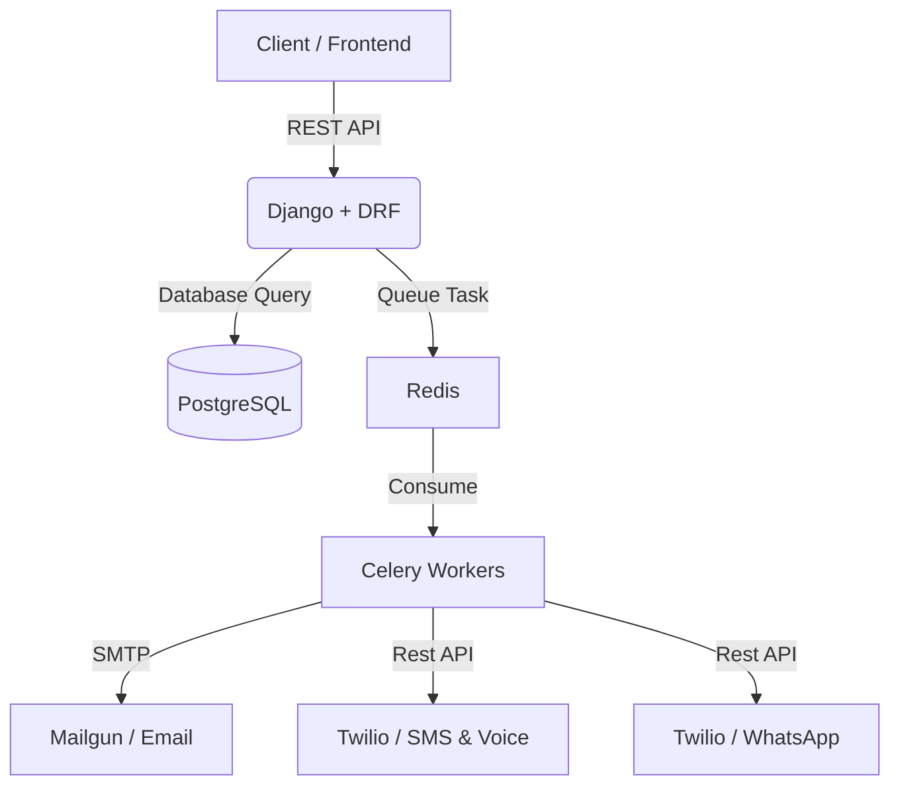

# 🚀 ContactAll API: Advanced Campaign Orchestration

> **Modern Public Health Communication & Management System**

ContactAll is a robust Django-based API designed to orchestrate large-scale communication campaigns across multiple channels including **Email**, **SMS**, **WhatsApp**, and **Voice Calls**. Built with security, modularity, and scalability at its core.

---

## 🏛️ System Architecture

Our architecture is designed for high-throughput and reliable delivery of messages.



---

## ✨ Key Features

- **Multi-Channel Delivery**: Unified interface for Email, SMS, WhatsApp, and Voice (TTS/File).
- **Campaign Management**: Automated scheduling and management of communication windows.
- **Advanced Analytics**: Real-time statistics and summaries of campaign performance.
- **Secure Authentication**: Robust JWT-based authentication for operators and users.
- **Specialized Media Models**: Clean inheritance-based model structure for channel-specific data.
- **Background Processing**: Reliable task execution powered by Celery and Redis.

---

## 🛠️ Technology Stack

| Category | Technology |
| :--- | :--- |
| **Framework** | [Django 5.2](https://www.djangoproject.com/) |
| **API** | [Django REST Framework](https://www.django-rest-framework.org/) |
| **Database** | [PostgreSQL](https://www.postgresql.org/) |
| **Task Queue** | [Celery](https://docs.celeryproject.org/) + [Redis](https://redis.io/) |
| **Communication** | [Twilio](https://www.twilio.com/), [Mailgun](https://www.mailgun.com/) |
| **Security** | [PyJWT](https://pyjwt.readthedocs.io/), [Django-OTP](https://django-otp-official.readthedocs.io/) |

---

## 🚀 Getting Started

### 1. Environment Setup
We recommend using **Conda** for environment management:

```bash
conda create -n contactallapi python=3.14
conda activate contactallapi
pip install -r requirements.txt
```

### 2. Configuration
Create a `.env` file in the project root following the structure in `.env.example`:

```env
# Core Django
SECRET_KEY=your_secret_key
DEBUG=True

# Database
postdbName=your_db_name
post_user=your_user
post_password=your_password
postHost=localhost

# Redis
REDIS_URL=redis://localhost:6379/0
```

### 3. Database & Tasks
Initialize your database and start the workers:

```bash
# Sincronizar modelos
python manage.py migrate

# Iniciar Celery Worker
celery -A salud_publica worker --loglevel=info

# Iniciar Celery Beat (Scheduler)
celery -A salud_publica beat --loglevel=info
```

---

## 🧪 Development & Testing

We maintain a high standard of code quality through comprehensive testing.

```bash
# Ejecutar suite de pruebas
python manage.py test campaigns
```

---

## 🌐 API Overview

All modern endpoints are served under `/campaigns/api/`:

- `GET /campaigns/api/campaigns/` - List all campaigns.
- `POST /campaigns/api/campaigns/` - Create a new campaign (complex setup).
- `GET /campaigns/api/campaigns/{id}/statistics/` - Detailed performance metrics.
- `GET /campaigns/api/contacts/existing_groups/` - List predefined contact groups.

---

## ☁️ Deployment Notes

### Heroku
```bash
git push heroku master
```

### Google Cloud (Compute Engine)
1. **Prepare VM**: Connect via SSH and pull latest changes.
2. **Restart Service**:
```bash
sudo pkill gunicorn
sudo gunicorn --config dev.py salud_publica.wsgi
```

---

> [!NOTE]
> This project was recently refactored to prioritize **Class-Based Views**, **Model Inheritance**, and **JWT Authentication**. Legacy functional views have been deprecated in favor of the new ViewSet architecture.

---
Produced with ❤️ by **Antigravity** (Gemi Holmes)